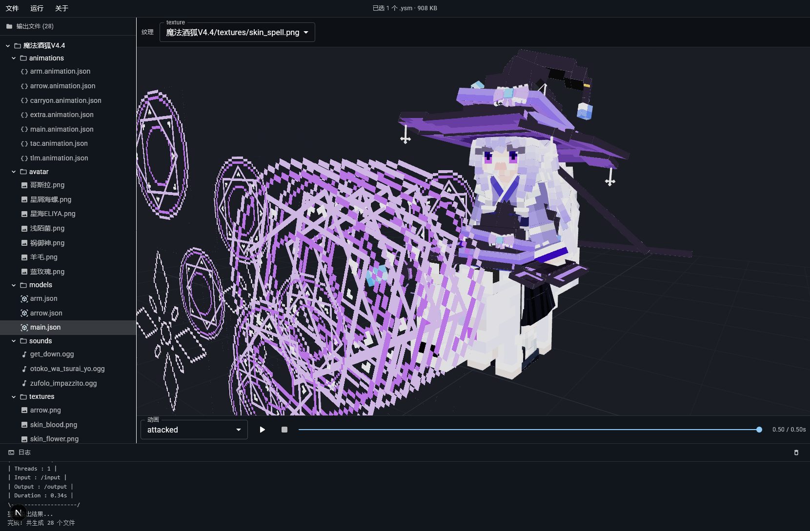

# YSMParser-GUI



[YSMParser](https://github.com/OpenYSM/YSMParser) GUI

在线使用：https://www.ysm.rip/parser/app

## 快速开始

```bash
npm install
npm run dev
```

打开 <http://localhost:3000> 即可使用。

## 鸣谢

- **TartaricAcid**: 创建了YesSteveModel。
- **[Blockbench](https://www.blockbench.net/)：** 本项目模型渲染与动画部分移植自Blockbench代码。